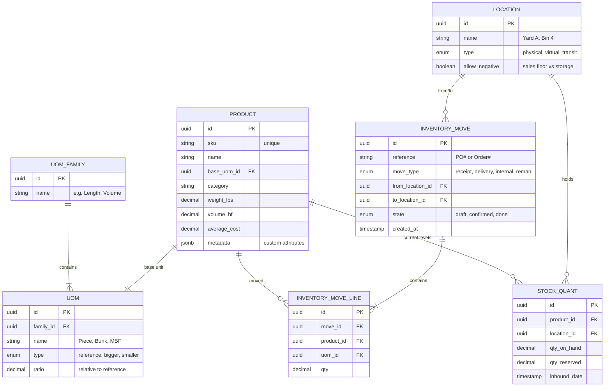
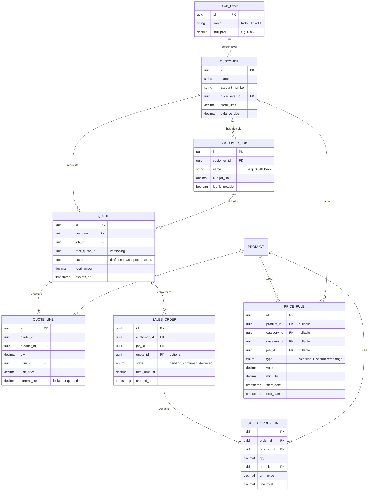
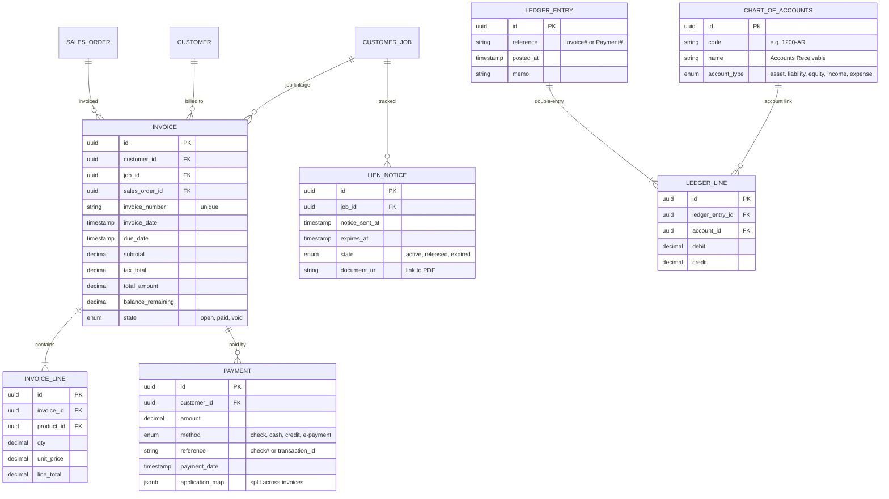

# GableLBM: Database Entity Relationship Diagram

This document defines the physical data model for GableLBM. We prioritize data integrity, unit-awareness, and a "double-entry" ledger for all asset movements (Inventory, Cash, Receivables).

## Core Principles
1. **Always UUID**: All primary keys are `UUID v4`.
2. **Atomic Units**: Physical quantities are stored in `decimal(19,4)` to prevent rounding errors.
3. **Double-Entry Everything**: Inventory isn't just "updated"; it's moved from `FromLocation` to `ToLocation`.
4. **Unit Awareness**: Every quantity must be paired with a `UOMID`.

---

## 1. Inventory Module

The Inventory module handles the complexity of LBM products, conversions (Piece to MBF), and multi-yard logistics.

### Mermaid ERD


### PostgreSQL Schema (Excerpt)

```sql
-- Core Types
CREATE TYPE move_state AS ENUM ('draft', 'confirmed', 'done', 'cancelled');
CREATE TYPE location_type AS ENUM ('physical', 'virtual', 'transit', 'production');

-- Products
CREATE TABLE products (
    id UUID PRIMARY KEY DEFAULT gen_random_uuid(),
    sku VARCHAR(100) UNIQUE NOT NULL,
    name VARCHAR(255) NOT NULL,
    base_uom_id UUID NOT NULL,
    category VARCHAR(100),
    weight_lbs DECIMAL(19,4) DEFAULT 0,
    volume_bf DECIMAL(19,4) DEFAULT 0,
    average_cost DECIMAL(19,4) DEFAULT 0,
    metadata JSONB,
    created_at TIMESTAMP WITH TIME ZONE DEFAULT NOW(),
    updated_at TIMESTAMP WITH TIME ZONE DEFAULT NOW()
);

-- UOM System
CREATE TABLE uom_families (
    id UUID PRIMARY KEY DEFAULT gen_random_uuid(),
    name VARCHAR(100) NOT NULL
);

CREATE TABLE uoms (
    id UUID PRIMARY KEY DEFAULT gen_random_uuid(),
    family_id UUID REFERENCES uom_families(id),
    name VARCHAR(50) NOT NULL,
    ratio DECIMAL(19,8) NOT NULL,
    created_at TIMESTAMP WITH TIME ZONE DEFAULT NOW()
);

-- Locations & Stock
CREATE TABLE locations (
    id UUID PRIMARY KEY DEFAULT gen_random_uuid(),
    name VARCHAR(100) NOT NULL,
    type location_type DEFAULT 'physical',
    parent_id UUID REFERENCES locations(id),
    is_active BOOLEAN DEFAULT TRUE
);

CREATE TABLE stock_quant (
    id UUID PRIMARY KEY DEFAULT gen_random_uuid(),
    product_id UUID REFERENCES products(id),
    location_id UUID REFERENCES locations(id),
    qty_on_hand DECIMAL(19,4) NOT NULL DEFAULT 0,
    qty_reserved DECIMAL(19,4) NOT NULL DEFAULT 0,
    lot_number VARCHAR(100),
    inbound_date TIMESTAMP WITH TIME ZONE DEFAULT NOW(),
    UNIQUE(product_id, location_id, lot_number)
);

-- The Double-Entry Engine
CREATE TABLE inventory_moves (
    id UUID PRIMARY KEY DEFAULT gen_random_uuid(),
    reference VARCHAR(255),
    move_type VARCHAR(50),
    from_location_id UUID REFERENCES locations(id),
    to_location_id UUID REFERENCES locations(id),
    state move_state DEFAULT 'draft',
    created_at TIMESTAMP WITH TIME ZONE DEFAULT NOW()
);

CREATE TABLE inventory_move_lines (
    id UUID PRIMARY KEY DEFAULT gen_random_uuid(),
    move_id UUID REFERENCES inventory_moves(id) ON DELETE CASCADE,
    product_id UUID REFERENCES products(id),
    uom_id UUID REFERENCES uoms(id),
    qty DECIMAL(19,4) NOT NULL,
    created_at TIMESTAMP WITH TIME ZONE DEFAULT NOW()
);
```

---

## 2. Sales & Pricing Module

The Sales module implements the core pricing waterfall and order management flows.

### Mermaid ERD


### PostgreSQL Schema (Excerpt)

```sql
-- Pricing
CREATE TABLE price_levels (
    id UUID PRIMARY KEY DEFAULT gen_random_uuid(),
    name VARCHAR(100) NOT NULL,
    multiplier DECIMAL(19,4) NOT NULL DEFAULT 1.0,
    created_at TIMESTAMP WITH TIME ZONE DEFAULT NOW()
);

-- Customers
CREATE TABLE customers (
    id UUID PRIMARY KEY DEFAULT gen_random_uuid(),
    name VARCHAR(255) NOT NULL,
    account_number VARCHAR(50) UNIQUE NOT NULL,
    price_level_id UUID REFERENCES price_levels(id),
    credit_limit DECIMAL(19,4) DEFAULT 0,
    balance_due DECIMAL(19,4) DEFAULT 0,
    created_at TIMESTAMP WITH TIME ZONE DEFAULT NOW()
);

CREATE TABLE customer_jobs (
    id UUID PRIMARY KEY DEFAULT gen_random_uuid(),
    customer_id UUID REFERENCES customers(id),
    name VARCHAR(255) NOT NULL,
    budget_limit DECIMAL(19,4) DEFAULT 0,
    job_is_taxable BOOLEAN DEFAULT TRUE,
    created_at TIMESTAMP WITH TIME ZONE DEFAULT NOW()
);

-- The Pricing Waterfall
CREATE TABLE price_rules (
    id UUID PRIMARY KEY DEFAULT gen_random_uuid(),
    product_id UUID REFERENCES products(id),
    customer_id UUID REFERENCES customers(id),
    job_id UUID REFERENCES customer_jobs(id),
    type VARCHAR(50) NOT NULL,
    value DECIMAL(19,4) NOT NULL,
    min_qty DECIMAL(19,4) DEFAULT 0,
    start_date TIMESTAMP WITH TIME ZONE,
    end_date TIMESTAMP WITH TIME ZONE,
    priority INTEGER DEFAULT 0
);

-- Quotes & Orders
CREATE TABLE quotes (
    id UUID PRIMARY KEY DEFAULT gen_random_uuid(),
    customer_id UUID REFERENCES customers(id),
    job_id UUID REFERENCES customer_jobs(id),
    root_quote_id UUID REFERENCES quotes(id),
    state VARCHAR(50) DEFAULT 'draft',
    total_amount DECIMAL(19,4) DEFAULT 0,
    expires_at TIMESTAMP WITH TIME ZONE,
    created_at TIMESTAMP WITH TIME ZONE DEFAULT NOW()
);

CREATE TABLE quote_lines (
    id UUID PRIMARY KEY DEFAULT gen_random_uuid(),
    quote_id UUID REFERENCES quotes(id) ON DELETE CASCADE,
    product_id UUID REFERENCES products(id),
    uom_id UUID REFERENCES uoms(id),
    qty DECIMAL(19,4) NOT NULL,
    unit_price DECIMAL(19,4) NOT NULL,
    current_cost DECIMAL(19,4) NOT NULL
);

CREATE TABLE sales_orders (
    id UUID PRIMARY KEY DEFAULT gen_random_uuid(),
    customer_id UUID REFERENCES customers(id),
    job_id UUID REFERENCES customer_jobs(id),
    quote_id UUID REFERENCES quotes(id),
    state VARCHAR(50) DEFAULT 'pending',
    total_amount DECIMAL(19,4) DEFAULT 0,
    created_at TIMESTAMP WITH TIME ZONE DEFAULT NOW()
);

CREATE TABLE sales_order_lines (
    id UUID PRIMARY KEY DEFAULT gen_random_uuid(),
    order_id UUID REFERENCES sales_orders(id) ON DELETE CASCADE,
    product_id UUID REFERENCES products(id),
    uom_id UUID REFERENCES uoms(id),
    qty DECIMAL(19,4) NOT NULL,
    unit_price DECIMAL(19,4) NOT NULL,
    line_total DECIMAL(19,4) NOT NULL
);
```

---

## 3. Finance & Job Accounting Module

The Finance module handles AR, Invoicing, and a strict double-entry ledger for all financial transactions.

### Mermaid ERD


### PostgreSQL Schema (Excerpt)

```sql
-- Chart of Accounts
CREATE TABLE chart_of_accounts (
    id UUID PRIMARY KEY DEFAULT gen_random_uuid(),
    code VARCHAR(50) UNIQUE NOT NULL,
    name VARCHAR(255) NOT NULL,
    account_type VARCHAR(50) NOT NULL,
    is_active BOOLEAN DEFAULT TRUE
);

-- Invoices
CREATE TABLE invoices (
    id UUID PRIMARY KEY DEFAULT gen_random_uuid(),
    customer_id UUID REFERENCES customers(id),
    job_id UUID REFERENCES customer_jobs(id),
    sales_order_id UUID REFERENCES sales_orders(id),
    invoice_number VARCHAR(50) UNIQUE NOT NULL,
    invoice_date TIMESTAMP WITH TIME ZONE DEFAULT NOW(),
    due_date TIMESTAMP WITH TIME ZONE,
    subtotal DECIMAL(19,4) NOT NULL,
    tax_total DECIMAL(19,4) NOT NULL,
    total_amount DECIMAL(19,4) NOT NULL,
    balance_remaining DECIMAL(19,4) NOT NULL,
    state VARCHAR(50) DEFAULT 'open',
    created_at TIMESTAMP WITH TIME ZONE DEFAULT NOW()
);

CREATE TABLE invoice_lines (
    id UUID PRIMARY KEY DEFAULT gen_random_uuid(),
    invoice_id UUID REFERENCES invoices(id) ON DELETE CASCADE,
    product_id UUID REFERENCES products(id),
    qty DECIMAL(19,4) NOT NULL,
    unit_price DECIMAL(19,4) NOT NULL,
    line_total DECIMAL(19,4) NOT NULL
);

-- Payments
CREATE TABLE payments (
    id UUID PRIMARY KEY DEFAULT gen_random_uuid(),
    customer_id UUID REFERENCES customers(id),
    amount DECIMAL(19,4) NOT NULL,
    payment_method VARCHAR(50),
    reference_number VARCHAR(255),
    payment_date TIMESTAMP WITH TIME ZONE DEFAULT NOW(),
    application_map JSONB
);

-- Construction Lien Tracking
CREATE TABLE lien_notices (
    id UUID PRIMARY KEY DEFAULT gen_random_uuid(),
    job_id UUID REFERENCES customer_jobs(id),
    notice_sent_at TIMESTAMP WITH TIME ZONE,
    expires_at TIMESTAMP WITH TIME ZONE,
    state VARCHAR(50) DEFAULT 'active',
    document_url VARCHAR(2048)
);

-- Double-Entry Ledger
CREATE TABLE ledger_entries (
    id UUID PRIMARY KEY DEFAULT gen_random_uuid(),
    reference VARCHAR(255),
    posted_at TIMESTAMP WITH TIME ZONE DEFAULT NOW(),
    memo TEXT
);

CREATE TABLE ledger_lines (
    id UUID PRIMARY KEY DEFAULT gen_random_uuid(),
    ledger_entry_id UUID REFERENCES ledger_entries(id) ON DELETE CASCADE,
    account_id UUID REFERENCES chart_of_accounts(id),
    debit DECIMAL(19,4) NOT NULL DEFAULT 0,
    credit DECIMAL(19,4) NOT NULL DEFAULT 0
);
```
